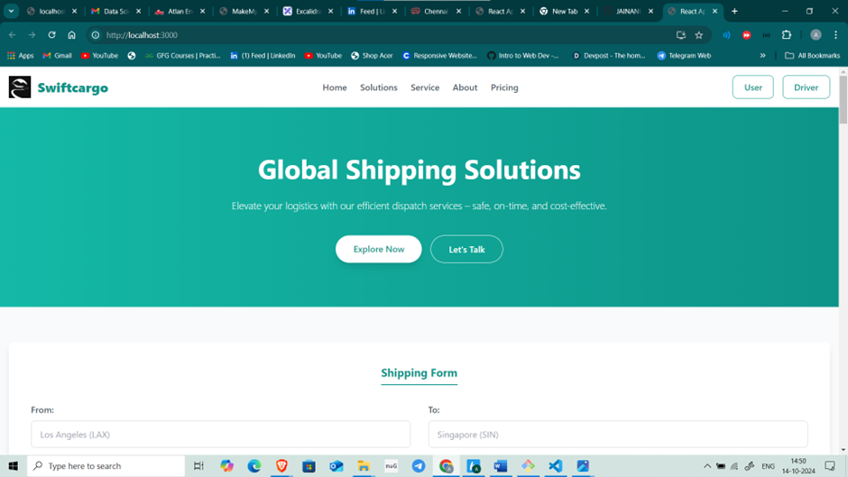
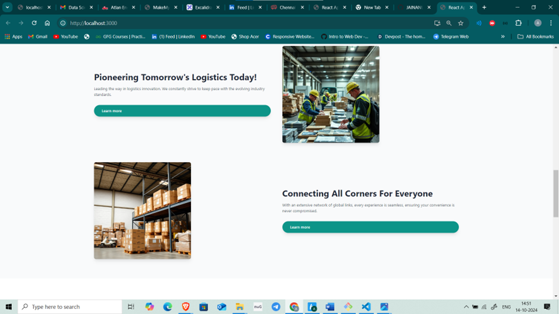
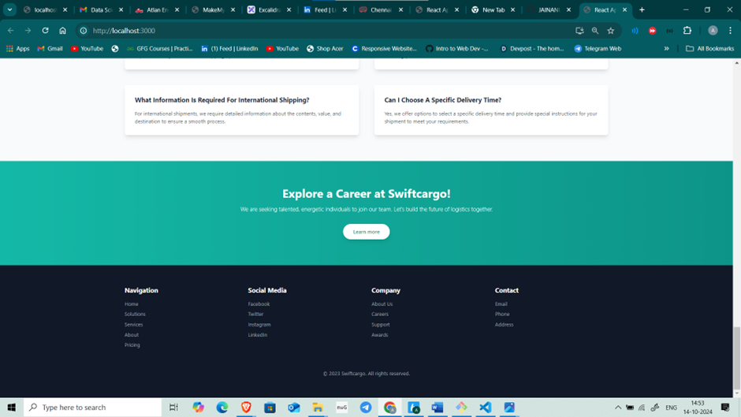
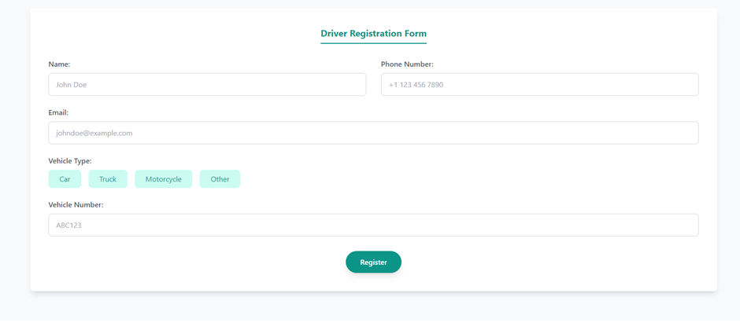

# Internship_task

**I. Introduction**

The logistics platform is designed to provide a scalable and efficient solution for goods transportation. The platform connects users who need to transport items with a fleet of drivers, providing real-time availability, pricing, and tracking of vehicles.

**II. System Architecture**

The system architecture consists of the following components:

- User Interface: provides a user-friendly interface for users to book transportation services.
- Booking Service: handles booking requests, including pricing and availability.
- Driver Service: manages driver information, including availability and location.
- Vehicle Service: manages vehicle information, including type and capacity.
- GPS Tracking Service: provides real-time GPS tracking of vehicles.
- Payment Service: handles payment processing and transactions.

**III. Component Design**

### Booking Service

- Handles booking requests, including pricing and availability.
- Interacts with the Driver Service and Vehicle Service to determine availability.
- Provides real-time pricing and availability information to the User Interface.

### Driver Service

- Manages driver information, including availability and location.
- Interacts with the Booking Service to determine driver availability.
- Provides real-time driver location information to the GPS Tracking Service.

**IV. Database Design**

The database schema consists of the following entities:

- Users
- Drivers
- Bookings
- Vehicles
- Payment Records
- GPS Tracking Data

**V. Scalability and Performance**

The system is designed to handle high traffic and frequent updates. The following strategies are used to achieve scalability and performance:

- Load balancing: distributes incoming traffic across multiple instances.
- Caching: stores frequently accessed data to reduce database queries.
- Distributed databases: uses a sharded database architecture to handle high-frequency updates and transactions.

**VI. Real-Time Data Handling**

The system is designed to handle real-time GPS tracking data. The following strategies are used to handle real-time data:

- Message broker: uses a message broker like Apache Kafka or RabbitMQ to handle real-time GPS data updates.
- Caching: stores frequently accessed data to reduce database queries.
- Data streaming: uses a data streaming service like Apache Kafka or Amazon Kinesis to handle real-time data.

**VI. DEMO**

## Landing Page

## User Page

## Drive page

